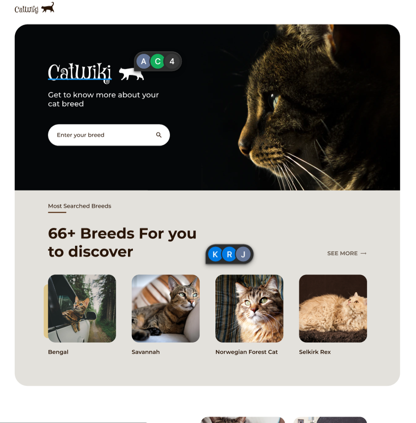

# Proyecto catwiki

## Descripción

- Este proyecto es uno de los propuestos de la web de [devchallenges](https://devchallenges.io/challenges/f4NJ53rcfgrP6sBMD2jt) que es crear una web donde puedes realizar busquedas de distintos tipos de razas de gatos y mostrar sus características.

## Recursos

- Diseño: Este challenge ya nos provee de un diseño realizado en Figma, puedes verlo desde [aquí](https://www.figma.com/file/6XLJCClikameMhnTZ3RKnM/CatWiki?type=design&node-id=1-2&t=sBHEqOkpambEkBIS-0)

- Api: La api que se usará es [thecatapi](https://developers.thecatapi.com/view-account/ylX4blBYT9FaoVd6OhvR?report=bOoHBz-8t) para obtener las razas de los gatitos.

## Tecnologías

- React v18.2
- Typescript
- Eslint, husky y prettier
- Vitest y Testing library
- Redux toolkit
- CI/CD
- Docker
- Jira

## Instalaciones previas

- Tener instalado [nvm](https://github.com/nvm-sh/nvm)
- Instalar [yarn](https://classic.yarnpkg.com/lang/en/docs/install/#windows-stable)

## Pasos para correr el proyecto localmente

Una ves que ya se tenga instalado nvm ejecutar el siguiente comando

`nvm use <node_version>`, para saber la version de node del proyecto deber ver el archivo .nvmrc en la raiz del proyecto y poner esa versión.

Para instalar las dependencias
`yarn install`

Para correr el proyecto localmente
`yarn dev`

## Deploy

- Se esta optando realizar el despliegue de la web en vercel

## RAMAS

* MAIN -> Rama de producción -> vercel
* DEVELOP -> Rama de desarrollo
  * feature/CC-10 -> Rama para leer la documentacion de la api
  * feature/**
  * feature/CC-20 -> CI/CD para la automatizacion de deployment continuo

# COMANDOS ÚTILES
  git stash save -u // poner en una papelera

## Colaboradores

- [Walter Daniel](https://www.linkedin.com/in/wdanielaguilar/)
- Nahuel Galeano

buenas practicas

* que sean entendibles
* camelCase

* GIT HOOKS -> GIT

  * githook pre commit -> para cuando generes tu commit
  * githook commit-msg -> para cuando quieras poner un mensaje en tu commit
  * githook pre push -> para cuando quieras pushear tus cambios

  * commitlint -> te da un estandar conventional-commit de angular

    * feat: alguna feature(de tu proyecto)
    * docs: para documentacion(readme.md)
    * ci: para continuos integration/ CD
    * test: para archivos testing
    * style: para formateo de codigo
    ... others

por ejemplo

git commit -m "un mensaje que quiero subir";

con el estandar conventional-commit

git commit -m "feat: add home page"

por detras se ejecuta el husky -> para automatizar
  * formateo de codigo
  * linteo de codigo(estilo de código)

